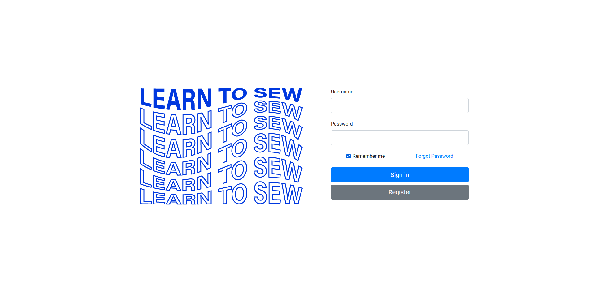
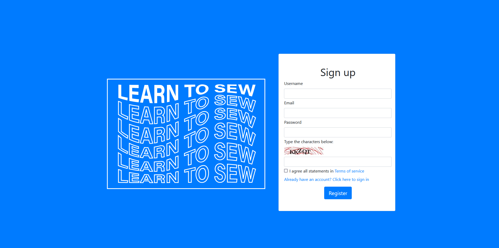
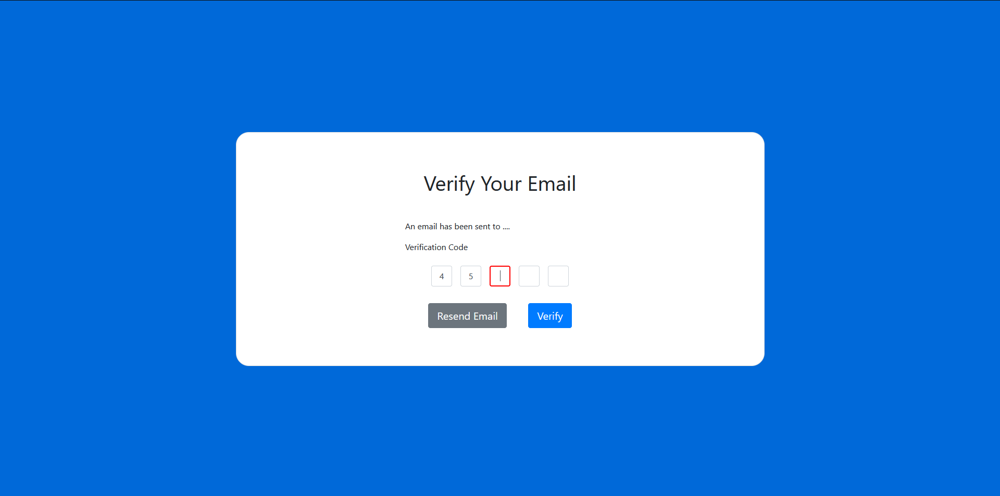
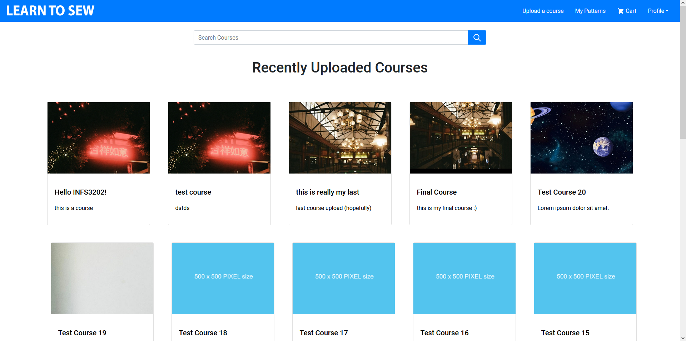
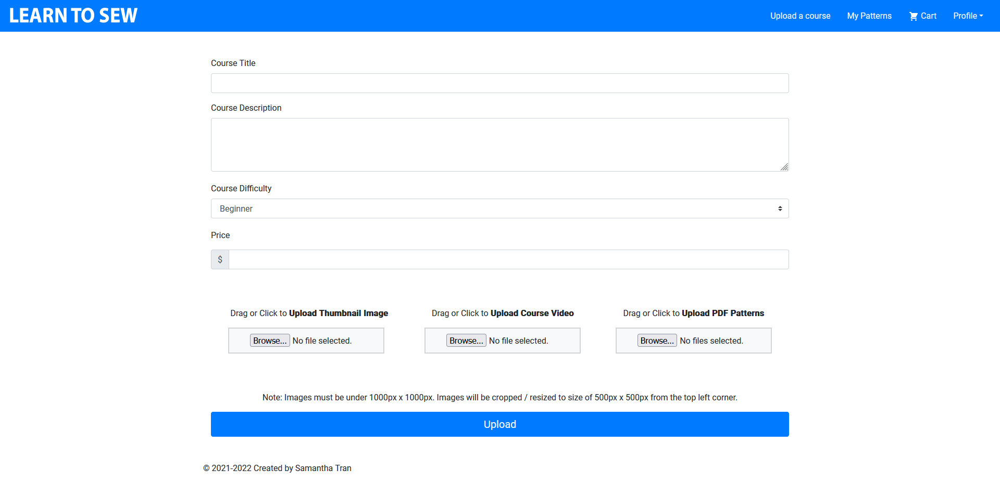
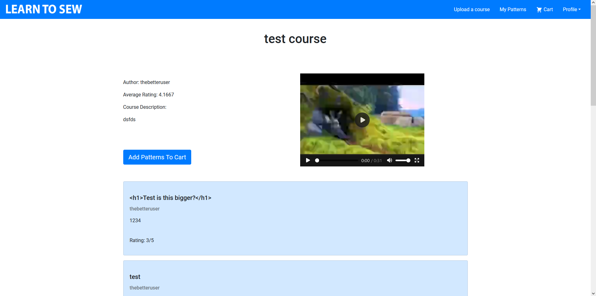
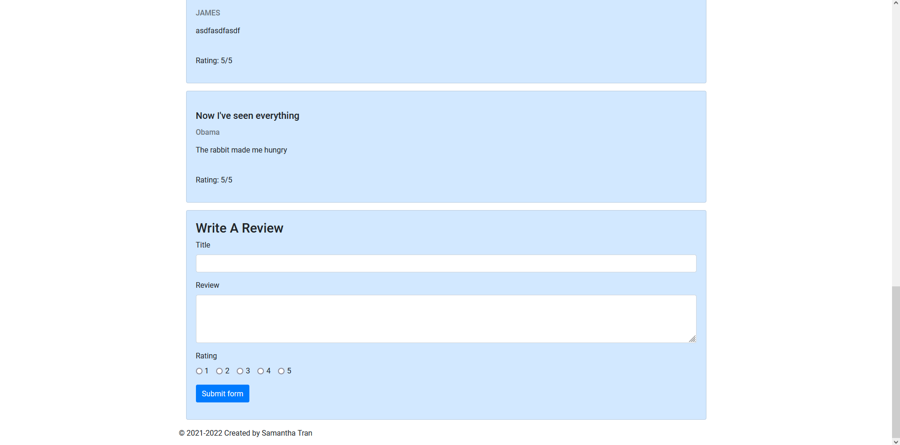
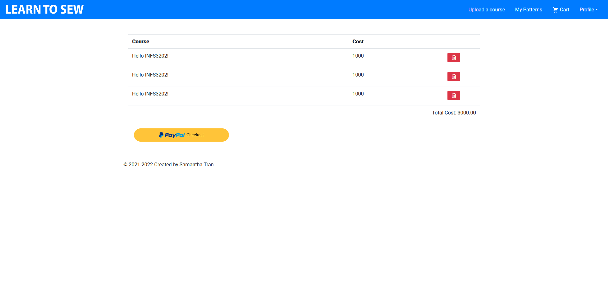

# LearnToSew
The proposed website is an online learning platform, specifically for users wanting to learn to sew. Sewing
instructors often post free videos on YouTube, showcasing how to create a specific garment. In order to
monetise this, they often provide a link to an external e-commerce website where users can buy the pattern for
the garment (or the garment itself). The goal of the website is to create an all-in-one sewing platform where
instructors can easily monetise their content and students can lear

## Login

## Register

## Verification

## Profile 

## Explore 

## Course Creation 

## Course Details 

## Shopping Cart 

